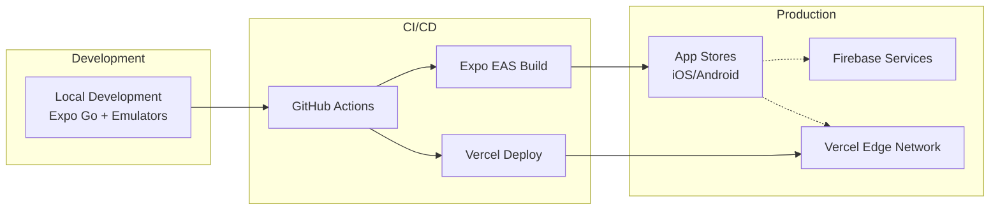

# Infrastructure and Deployment Integration

## Existing Infrastructure

**Current Deployment:** Expo EAS Build for mobile apps, Firebase managed services
**Infrastructure Tools:** Firebase CLI, Expo CLI
**Environments:** Development (Expo Go), Staging (EAS), Production (App Store/Play Store)

## Enhancement Deployment Strategy

**Deployment Approach:** Parallel deployment - Edge Functions on Vercel, maintain Firebase for core
**Infrastructure Changes:** Add Vercel project for Edge Functions, configure environment variables
**Pipeline Integration:** GitHub Actions for Edge Functions, existing EAS for mobile

## Deployment Architecture

## Rollback Strategy

**Rollback Method:** Feature flags via Firebase Remote Config - instant disable
**Risk Mitigation:** Canary deployment to 10% users, monitoring before full rollout
**Monitoring:** Real-time dashboards for AI latency, accuracy, and costs

---
