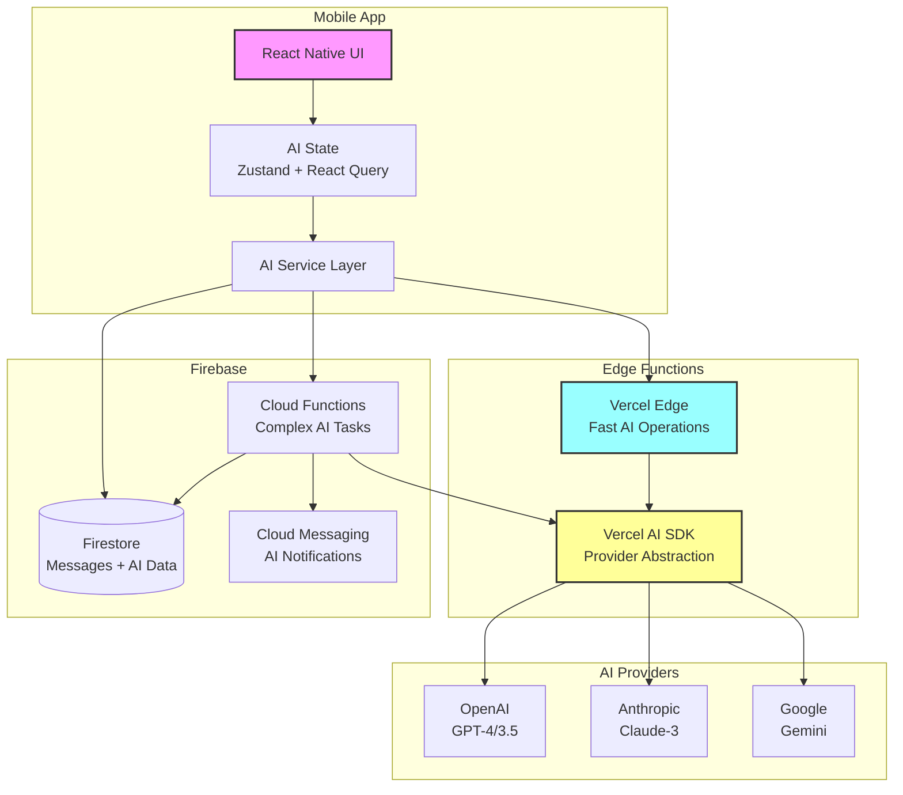

# Component Architecture

## New Components

### AI Service Layer

**Responsibility:** Unified interface for all AI operations
**Integration Points:** Edge Functions, Cloud Functions, Firestore

**Key Interfaces:**

- `categorizeMessage(message): Promise<Category>`
- `analyzeSentiment(text): Promise<Sentiment>`
- `generateResponse(context, voiceProfile): Promise<string>`
- `detectFaq(message, faqLibrary): Promise<FaqMatch>`

**Dependencies:**

- **Existing Components:** Firebase services, Message components
- **New Components:** Edge Function clients, AI provider abstraction
- **Technology Stack:** TypeScript, Vercel AI SDK, React Query

### Edge Function Services

**Responsibility:** Ultra-fast AI operations (<500ms)
**Integration Points:** Called from React Native app via HTTPS

**Key Interfaces:**

- `POST /api/ai/categorize` - Message categorization
- `POST /api/ai/sentiment` - Sentiment analysis
- `POST /api/ai/faq-detect` - FAQ pattern matching

**Dependencies:**

- **Existing Components:** None (stateless operations)
- **New Components:** AI provider abstraction
- **Technology Stack:** TypeScript, Vercel Edge Runtime, Vercel AI SDK

### Voice Training Service

**Responsibility:** Learn creator communication patterns
**Integration Points:** Firebase Cloud Functions with Firestore access

**Key Interfaces:**

- `trainVoiceModel(creatorId, messageHistory): Promise<VoiceProfile>`
- `updateVoiceProfile(creatorId, newMessages): Promise<void>`

**Dependencies:**

- **Existing Components:** Firestore message history
- **New Components:** AI training data storage
- **Technology Stack:** Node.js, Firebase Functions, Claude API

### AI Dashboard Components

**Responsibility:** Display AI insights and controls
**Integration Points:** Existing React Native screens

**Key Interfaces:**

- `<AIDashboard />` - Main command center
- `<CategoryFilter />` - Message filtering UI
- `<AIResponseSuggestion />` - Response draft UI
- `<FAQManager />` - FAQ template management

**Dependencies:**

- **Existing Components:** React Native Elements, Navigation
- **New Components:** AI Service Layer
- **Technology Stack:** React Native, TypeScript, Zustand

## Component Interaction Diagram

---
