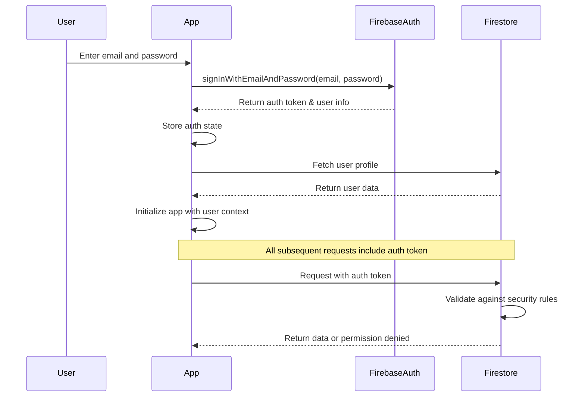

# Backend Architecture

## Service Architecture

Since we're using Firebase (serverless BaaS), the backend architecture consists of Firebase services configuration and optional Cloud Functions for server-side logic.

### Firebase SDK Approach

We use the **Firebase JavaScript SDK** (not React Native Firebase) for the following reasons:

- Compatible with Expo Go for rapid development cycles
- Supports all core features we need (Auth, Firestore, Storage)
- Uses API key configuration instead of native configuration files
- Allows seamless migration to Development Builds when needed

**Note:** For Android push notifications (Epic 3, Story 3.5), we'll migrate to Expo Development Builds while maintaining the same Firebase JS SDK configuration.

### Firebase Initialization

```typescript
// services/firebase.ts
import { initializeApp } from 'firebase/app';
import { getAuth } from 'firebase/auth';
import { getFirestore } from 'firebase/firestore';
import { getStorage } from 'firebase/storage';

const firebaseConfig = {
  apiKey: process.env.EXPO_PUBLIC_FIREBASE_API_KEY,
  authDomain: process.env.EXPO_PUBLIC_FIREBASE_AUTH_DOMAIN,
  projectId: process.env.EXPO_PUBLIC_FIREBASE_PROJECT_ID,
  storageBucket: process.env.EXPO_PUBLIC_FIREBASE_STORAGE_BUCKET,
  messagingSenderId: process.env.EXPO_PUBLIC_FIREBASE_MESSAGING_SENDER_ID,
  appId: process.env.EXPO_PUBLIC_FIREBASE_APP_ID,
};

const app = initializeApp(firebaseConfig);
export const auth = getAuth(app);
export const db = getFirestore(app);
export const storage = getStorage(app);
```

### Firebase Services Configuration

```
firebase-config/
├── firestore.rules          # Security rules
├── firestore.indexes.json   # Database indexes
├── storage.rules           # Storage security rules
└── functions/              # Optional Cloud Functions
    ├── src/
    │   ├── index.ts        # Function exports
    │   ├── messaging/      # FCM triggers
    │   │   └── sendNotification.ts
    │   └── users/          # User management
    │       └── onUserCreate.ts
    ├── package.json
    └── tsconfig.json
```

### Cloud Function Template (Optional)

```typescript
// functions/src/messaging/sendNotification.ts
import * as functions from 'firebase-functions';
import * as admin from 'firebase-admin';

export const sendMessageNotification = functions.firestore
  .document('conversations/{conversationId}/messages/{messageId}')
  .onCreate(async (snapshot, context) => {
    const message = snapshot.data();
    const conversationId = context.params.conversationId;

    // Get conversation to find recipients
    const conversationDoc = await admin
      .firestore()
      .collection('conversations')
      .doc(conversationId)
      .get();

    const conversation = conversationDoc.data();
    const recipientIds = conversation.participantIds.filter((id) => id !== message.senderId);

    // Get FCM tokens for recipients
    const userDocs = await Promise.all(
      recipientIds.map((id) => admin.firestore().collection('users').doc(id).get())
    );

    const tokens = userDocs.map((doc) => doc.data()?.fcmToken).filter((token) => token);

    if (tokens.length === 0) return;

    // Send notification
    const payload = {
      notification: {
        title: message.senderName,
        body: message.text,
        badge: '1',
      },
      data: {
        conversationId,
        messageId: context.params.messageId,
      },
    };

    await admin.messaging().sendToDevice(tokens, payload);
  });
```

## Database Architecture

### Data Access Layer

```typescript
// repositories/messageRepository.ts
import {
  collection,
  addDoc,
  updateDoc,
  query,
  orderBy,
  limit,
  startAfter,
  getDocs,
  doc,
  serverTimestamp,
  onSnapshot,
} from 'firebase/firestore';
import { firestore } from '@/services/firebase';

export class MessageRepository {
  private messagesCollection(conversationId: string) {
    return collection(firestore, 'conversations', conversationId, 'messages');
  }

  // Send a message with optimistic update
  async sendMessage(conversationId: string, text: string, senderId: string): Promise<Message> {
    const messageData = {
      senderId,
      text,
      status: 'sending',
      readBy: [senderId],
      timestamp: serverTimestamp(),
      metadata: {
        aiProcessed: false,
      },
    };

    const docRef = await addDoc(this.messagesCollection(conversationId), messageData);

    // Update conversation's last message
    await updateDoc(doc(firestore, 'conversations', conversationId), {
      lastMessage: {
        text,
        senderId,
        timestamp: serverTimestamp(),
      },
      lastMessageTimestamp: serverTimestamp(),
    });

    return {
      id: docRef.id,
      conversationId,
      ...messageData,
    } as Message;
  }

  // Load messages with pagination
  async loadMessages(
    conversationId: string,
    pageSize: number = 50,
    lastVisible?: any
  ): Promise<{ messages: Message[]; lastDoc: any }> {
    let q = query(
      this.messagesCollection(conversationId),
      orderBy('timestamp', 'desc'),
      limit(pageSize)
    );

    if (lastVisible) {
      q = query(q, startAfter(lastVisible));
    }

    const snapshot = await getDocs(q);
    const messages = snapshot.docs.map(
      (doc) =>
        ({
          id: doc.id,
          conversationId,
          ...doc.data(),
        }) as Message
    );

    const lastDoc = snapshot.docs[snapshot.docs.length - 1];

    return { messages, lastDoc };
  }

  // Subscribe to new messages
  subscribeToNewMessages(conversationId: string, callback: (message: Message) => void) {
    const q = query(
      this.messagesCollection(conversationId),
      orderBy('timestamp', 'desc'),
      limit(1)
    );

    return onSnapshot(q, (snapshot) => {
      snapshot.docChanges().forEach((change) => {
        if (change.type === 'added') {
          const message = {
            id: change.doc.id,
            conversationId,
            ...change.doc.data(),
          } as Message;
          callback(message);
        }
      });
    });
  }
}

export const messageRepository = new MessageRepository();
```

## Authentication and Authorization

### Auth Flow



### Middleware/Guards

```typescript
// hooks/useAuth.ts
import { useEffect, useState } from 'react';
import { onAuthStateChanged, User } from 'firebase/auth';
import { auth } from '@/services/firebase';
import { useStore } from '@/stores/appStore';

export function useAuth() {
  const [user, setUser] = useState<User | null>(null);
  const [isLoading, setIsLoading] = useState(true);
  const { setUser: setStoreUser } = useStore();

  useEffect(() => {
    const unsubscribe = onAuthStateChanged(auth, async (firebaseUser) => {
      if (firebaseUser) {
        setUser(firebaseUser);
        // Fetch additional user data from Firestore
        const userProfile = await getUserProfile(firebaseUser.uid);
        setStoreUser(userProfile);
      } else {
        setUser(null);
        setStoreUser(null);
      }
      setIsLoading(false);
    });

    return unsubscribe;
  }, []);

  return {
    user,
    isAuthenticated: !!user,
    isLoading
  };
}

// Protected route wrapper
export function withAuth<P extends object>(
  Component: React.ComponentType<P>
): React.FC<P> {
  return (props: P) => {
    const { isAuthenticated, isLoading } = useAuth();

    if (isLoading) {
      return <LoadingScreen />;
    }

    if (!isAuthenticated) {
      return <Redirect href="/login" />;
    }

    return <Component {...props} />;
  };
}
```

---
