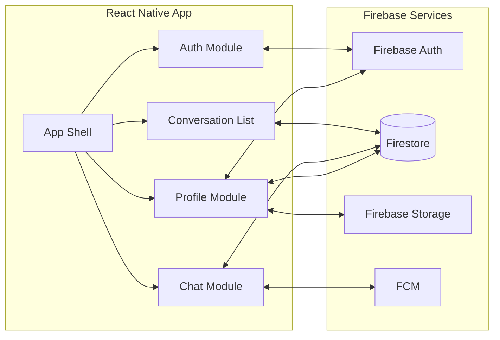

# Components

## Frontend Components

### App Shell

**Responsibility:** Root component managing navigation, authentication state, and global providers

**Key Interfaces:**

- Navigation container setup
- Auth state listener
- Global theme provider
- Push notification handler

**Dependencies:** React Navigation, Firebase Auth, Expo Notifications

**Technology Stack:** React Native, TypeScript, Expo managed workflow

### Authentication Module

**Responsibility:** Handle user authentication via Email/Password and session management

**Key Interfaces:**

- Registration form component
- Login form component
- Password reset component
- Username setup screen
- Auth context provider
- Auth state management

**Dependencies:** Firebase Auth SDK, App Shell

**Technology Stack:** React Native, Firebase Auth, React Context API

### Conversation List Module

**Responsibility:** Display and manage list of user conversations with real-time updates

**Key Interfaces:**

- ConversationList component
- ConversationListItem component
- Real-time conversation listener
- Swipe actions (archive/delete)

**Dependencies:** Firestore SDK, Navigation, User Presence Service

**Technology Stack:** React Native FlatList, Firestore real-time listeners, React Native Gesture Handler

### Chat Module

**Responsibility:** Core messaging interface for sending/receiving messages in real-time

**Key Interfaces:**

- ChatView component
- MessageList component (inverted FlatList pattern - industry standard)
- MessageInput component
- Message status indicators
- Read receipt viewability tracking
- Optimistic UI with atomic deduplication

**Dependencies:** Firestore SDK, User Service, Push Notification Service

**Technology Stack:** React Native inverted FlatList, Firestore real-time sync, Reanimated for animations

**Architecture Notes:**

- Uses inverted FlatList pattern (newest messages at index 0, rendered at bottom)
- Eliminates manual scroll management through React Native's built-in positioning
- Atomic deduplication in useMemo prevents race conditions during optimistic → confirmed transitions
- See: `docs/architecture/flatlist-viewability-patterns.md` for implementation details

### User Profile Module

**Responsibility:** Manage user profile data and settings

**Key Interfaces:**

- ProfileScreen component
- ProfileEdit component
- Settings component
- Image upload handler

**Dependencies:** Firebase Auth, Firebase Storage, Firestore

**Technology Stack:** React Native, Firebase Storage for photos, Expo Image Picker

## Backend Components (Firebase Services)

### Firebase Auth Service

**Responsibility:** User authentication and session management

**Key Interfaces:**

- Email/password credential verification
- User account creation and management
- Password reset email functionality
- Token generation and refresh
- Session persistence

**Dependencies:** None (managed service)

**Technology Stack:** Firebase Authentication (managed), Email/Password provider

### Firestore Database Service

**Responsibility:** Real-time data synchronization and offline persistence

**Key Interfaces:**

- Document CRUD operations
- Real-time listeners
- Offline queue management
- Security rules enforcement

**Dependencies:** Firebase Auth for user context

**Technology Stack:** Cloud Firestore (managed NoSQL database)

### Firebase Storage Service

**Responsibility:** Store and serve user profile photos and group images

**Key Interfaces:**

- Image upload with compression
- Secure URL generation
- Storage security rules

**Dependencies:** Firebase Auth for access control

**Technology Stack:** Firebase Storage (managed object storage)

### Push Notification Service

**Responsibility:** Deliver push notifications for new messages

**Key Interfaces:**

- FCM token management
- Notification payload creation
- Deep link handling
- Badge count updates

**Dependencies:** Firebase Cloud Messaging, Cloud Functions (optional)

**Technology Stack:** Firebase Cloud Messaging, Expo Notifications API

## Component Interaction Diagram

---
