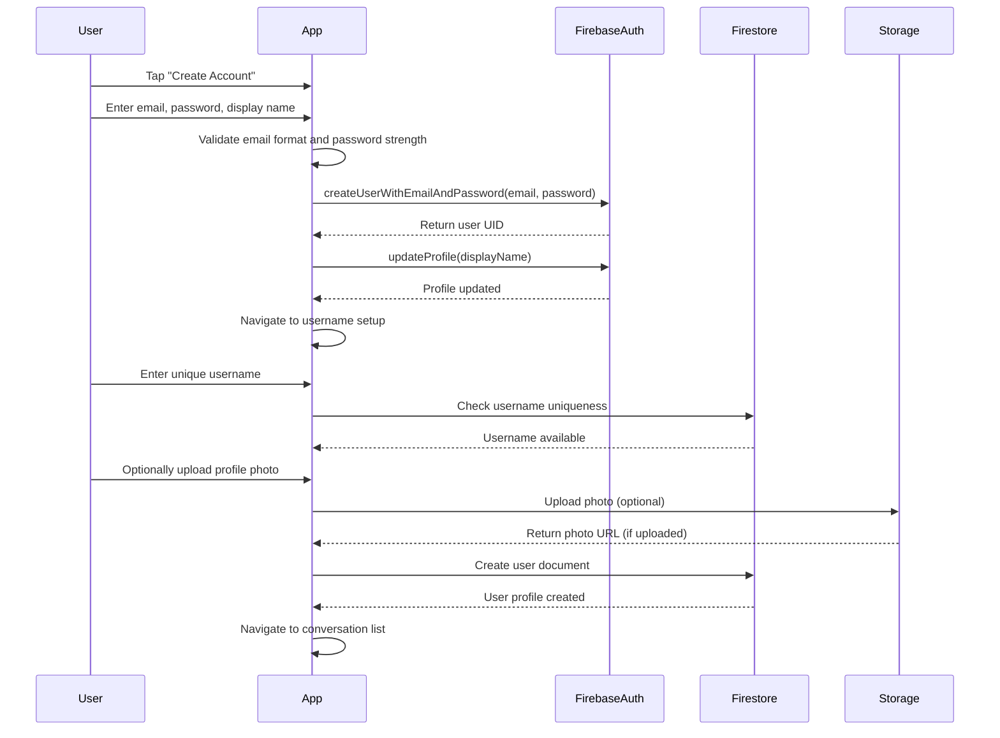
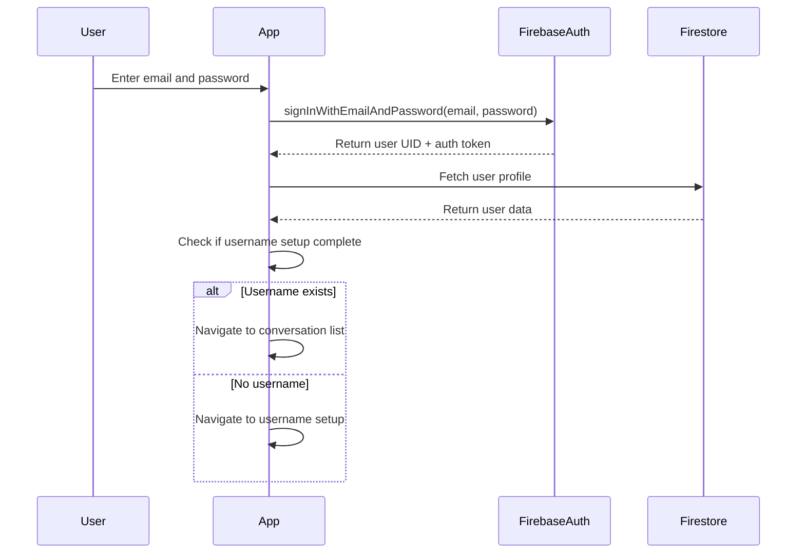
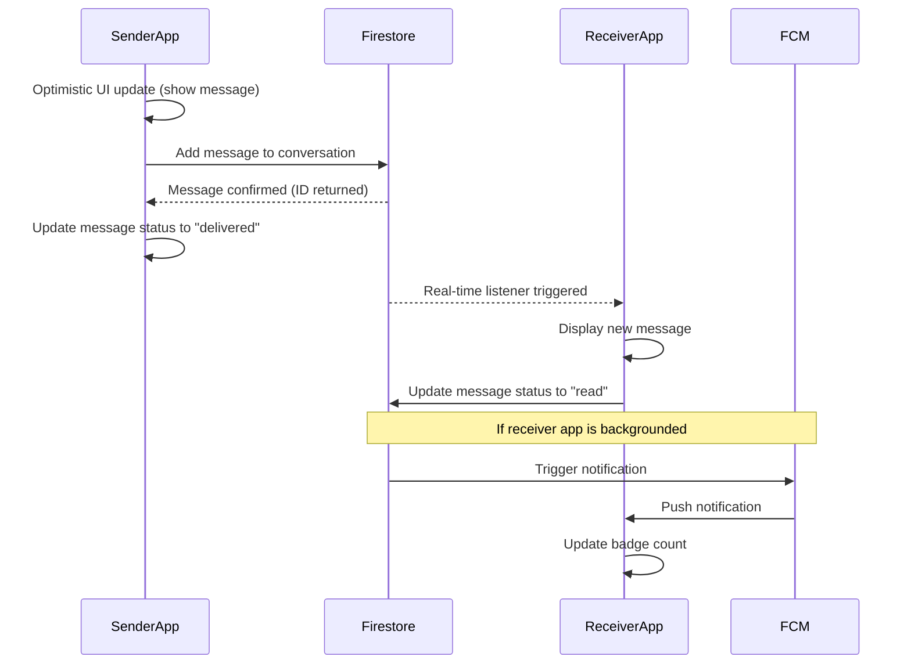
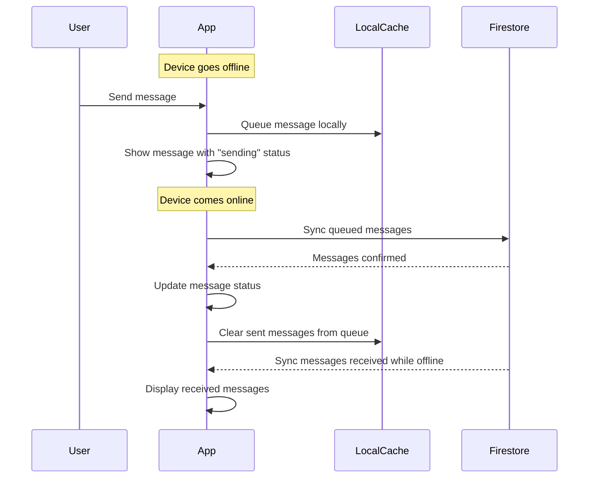
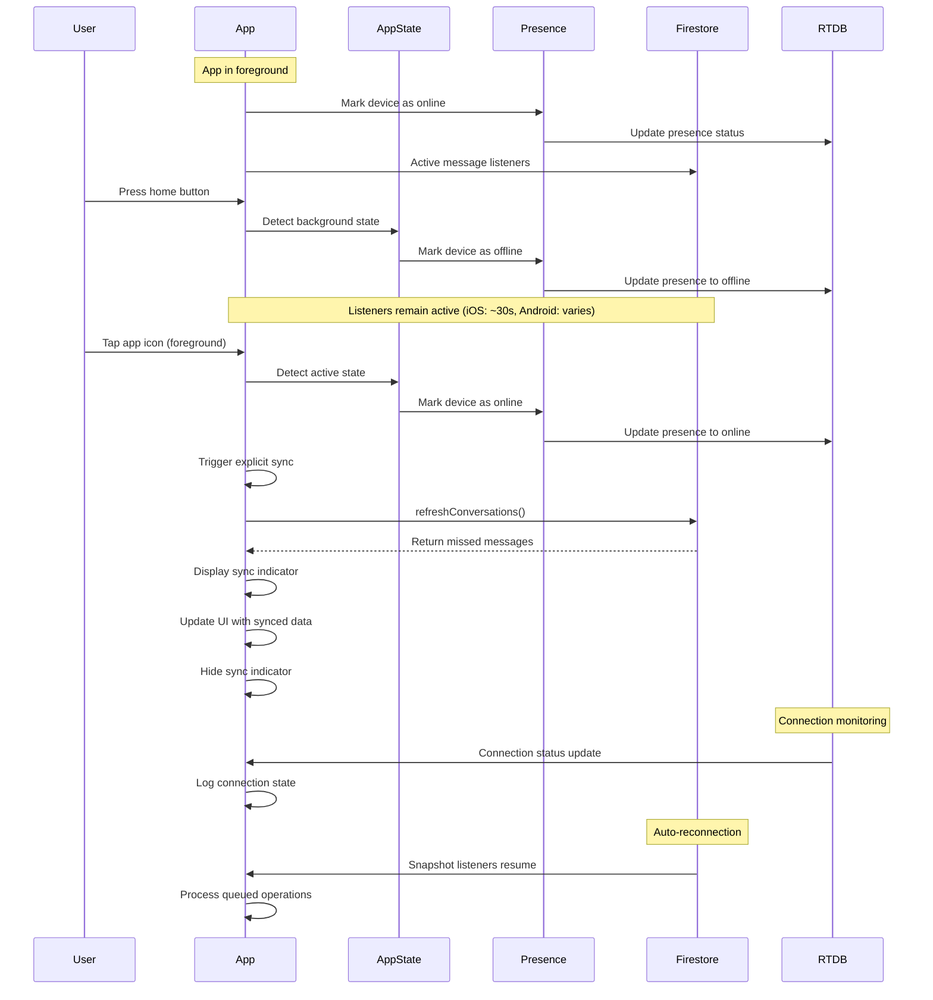

# Core Workflows

## User Registration and Onboarding Flow



## User Login Flow



## Real-time Message Send/Receive Flow



## Offline Message Sync Workflow



## App Lifecycle and Foreground Sync Flow



### Lifecycle State Transitions

The app manages three critical lifecycle states:

1. **Active (Foreground)**
   - Presence: Device marked as "online"
   - Realtime listeners: Active
   - Sync behavior: Automatic via listeners
   - Push notifications: Suppressed (user already in app)

2. **Background**
   - Presence: Device marked as "offline"
   - Realtime listeners: Active for limited time (platform-dependent)
   - Sync behavior: Queued for next foreground
   - Push notifications: Delivered to user

3. **Inactive (App Killed)**
   - Presence: Device marked as "offline" (via onDisconnect)
   - Realtime listeners: Cleaned up by OS
   - Sync behavior: Full sync on next launch
   - Push notifications: Delivered to user

### Explicit Foreground Sync

When the app returns to foreground, an explicit sync is triggered to ensure instant message recovery:

**Implementation:** `app/_layout.tsx:93-114`

```typescript
useEffect(() => {
  const subscription = AppState.addEventListener('change', async (nextAppState) => {
    const wasInBackground =
      appStateRef.current === 'background' || appStateRef.current === 'inactive';
    const isNowActive = nextAppState === 'active';

    if (wasInBackground && isNowActive && user?.uid) {
      console.log('[RootLayout] App foregrounded - triggering conversation sync');
      await refreshConversations(user.uid);
      console.log('[RootLayout] Conversation sync completed');
    }

    appStateRef.current = nextAppState;
  });

  return () => subscription.remove();
}, [user?.uid]);
```

**Why this matters:**

- Firebase's automatic reconnection can take 3-10 seconds
- Users expect instant message updates when foregrounding
- Explicit sync provides 1-3 second message recovery
- Prevents "blank screen" experience after backgrounding

### Connection Health Monitoring

Real-time connection monitoring provides visibility into Firebase RTDB and Firestore status:

**Implementation:** `hooks/useConnectionState.ts:142-177`

```typescript
// Firebase RTDB connection monitoring
unsubscribeRef.current = onValue(connectedRef, async (snapshot) => {
  const isConnected = snapshot.val() === true;

  if (isConnected) {
    console.log('[ConnectionState] ✅ Firebase RTDB connected');
    // Process queued operations
    await processQueue();
  } else {
    console.warn('[ConnectionState] ⚠️ Firebase RTDB disconnected');
    // Start reconnection handling
    handleReconnect();
  }
});
```

**Benefits:**

- Real-time visibility into connection status
- Queue management for offline operations
- Exponential backoff for reconnection attempts
- Debugging aid for connection issues

### Sync Indicator UI

Visual feedback during sync operations improves user experience:

**Implementation:** `components/common/SyncBanner.tsx`

```typescript
export const SyncBanner: FC<SyncBannerProps> = ({ isSyncing }) => {
  if (!isSyncing) return null;

  return (
    <Animated.View entering={SlideInUp.duration(300)} style={styles.banner}>
      <ActivityIndicator size="small" color="#fff" />
      <Text style={styles.text}>Syncing messages...</Text>
    </Animated.View>
  );
};
```

**User Experience:**

- Appears at top of screen during sync
- Slides in/out smoothly
- Auto-dismisses when sync completes
- Non-intrusive (transparent when not syncing)

### Battery Efficiency Considerations

The app balances real-time updates with battery conservation:

**Strategies:**

1. **Presence updates only on state changes** - Not continuous polling
2. **Listeners suspended in background** - Reduces network activity
3. **Queued operations** - Batch writes when reconnecting
4. **Exponential backoff** - Prevents aggressive reconnection attempts

**Trade-offs:**

- Instant updates in foreground
- Minimal battery drain in background
- Quick sync on foreground return

---
