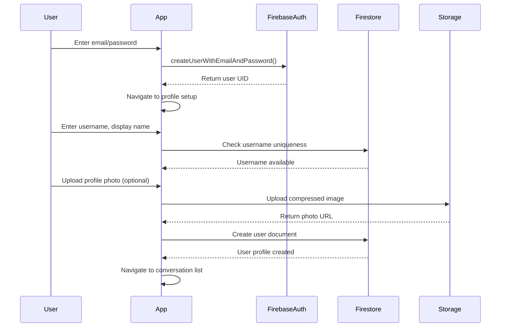
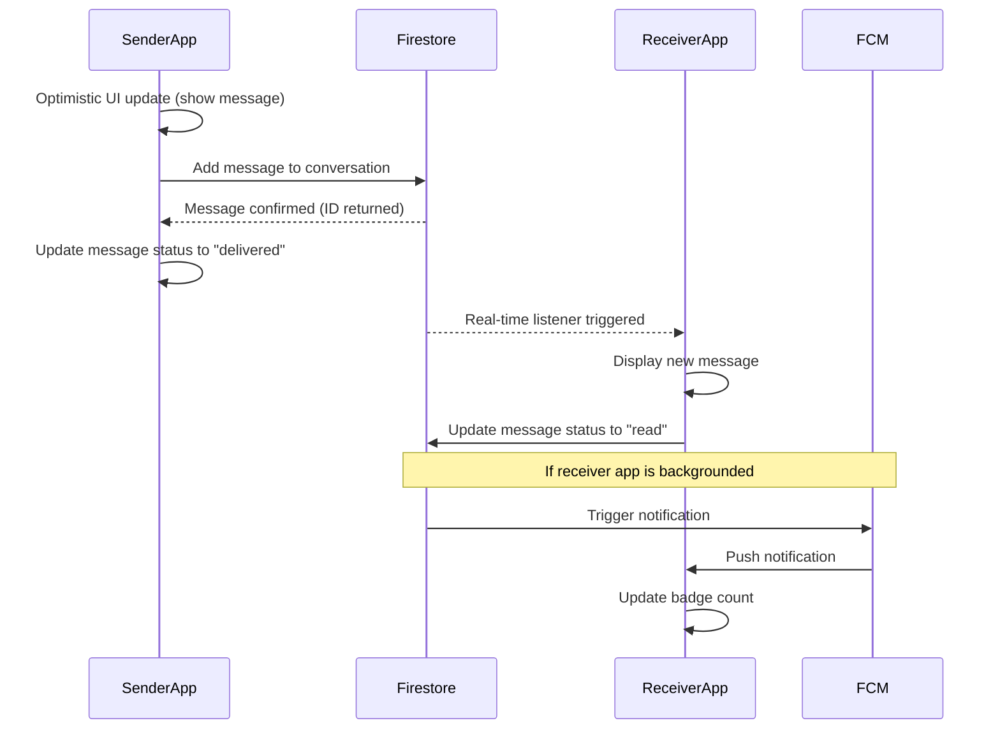
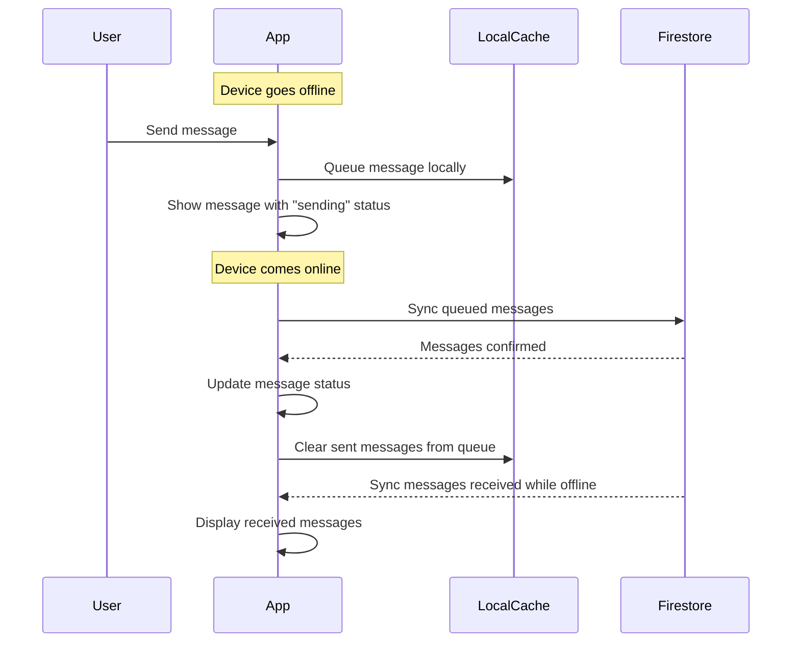

# Core Workflows

## User Registration and Onboarding Flow

```mermaid
sequenceDiagram
    participant User
    participant App
    participant FirebaseAuth
    participant Firestore
    participant Storage

    User->>App: Enter email/password
    App->>FirebaseAuth: createUserWithEmailAndPassword()
    FirebaseAuth-->>App: Return user UID
    App->>App: Navigate to profile setup
    User->>App: Enter username, display name
    App->>Firestore: Check username uniqueness
    Firestore-->>App: Username available
    User->>App: Upload profile photo (optional)
    App->>Storage: Upload compressed image
    Storage-->>App: Return photo URL
    App->>Firestore: Create user document
    Firestore-->>App: User profile created
    App->>App: Navigate to conversation list
```

## Real-time Message Send/Receive Flow

```mermaid
sequenceDiagram
    participant SenderApp
    participant Firestore
    participant ReceiverApp
    participant FCM

    SenderApp->>SenderApp: Optimistic UI update (show message)
    SenderApp->>Firestore: Add message to conversation
    Firestore-->>SenderApp: Message confirmed (ID returned)
    SenderApp->>SenderApp: Update message status to "delivered"

    Firestore-->>ReceiverApp: Real-time listener triggered
    ReceiverApp->>ReceiverApp: Display new message
    ReceiverApp->>Firestore: Update message status to "read"

    Note over Firestore,FCM: If receiver app is backgrounded
    Firestore->>FCM: Trigger notification
    FCM->>ReceiverApp: Push notification
    ReceiverApp->>ReceiverApp: Update badge count
```

## Offline Message Sync Workflow

```mermaid
sequenceDiagram
    participant User
    participant App
    participant LocalCache
    participant Firestore

    Note over App: Device goes offline
    User->>App: Send message
    App->>LocalCache: Queue message locally
    App->>App: Show message with "sending" status

    Note over App: Device comes online
    App->>Firestore: Sync queued messages
    Firestore-->>App: Messages confirmed
    App->>App: Update message status
    App->>LocalCache: Clear sent messages from queue

    Firestore-->>App: Sync messages received while offline
    App->>App: Display received messages
```

---
