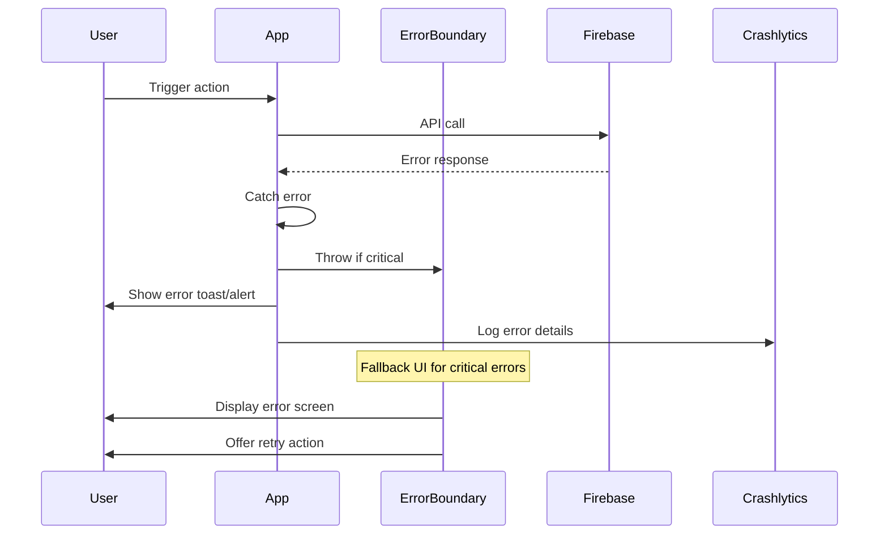

# Error Handling Strategy

## Error Flow



## Error Response Format

```typescript
interface ApiError {
  error: {
    code: string; // e.g., 'auth/invalid-email'
    message: string; // User-friendly message
    details?: Record<string, any>;
    timestamp: string;
    requestId: string;
  };
}
```

## Frontend Error Handling

```typescript
// hooks/useError.ts
export function useError() {
  const showError = (error: any) => {
    let message = 'An unexpected error occurred';

    if (error.code) {
      // Firebase errors
      message = getFirebaseErrorMessage(error.code);
    } else if (error.message) {
      message = error.message;
    }

    // Show toast notification
    Toast.show({
      type: 'error',
      text1: 'Error',
      text2: message,
      position: 'top',
    });

    // Log to Crashlytics
    crashlytics().recordError(error);
  };

  return { showError };
}

// Example usage in component
function ChatScreen() {
  const { showError } = useError();

  const sendMessage = async (text: string) => {
    try {
      await messageService.send(conversationId, text);
    } catch (error) {
      showError(error);
      // Revert optimistic update
      revertOptimisticMessage();
    }
  };
}
```

## Backend Error Handling

```typescript
// Cloud Function error handling (if used)
export const processMessage = functions.https.onCall(async (data, context) => {
  try {
    // Validate input
    if (!data.text || !data.conversationId) {
      throw new functions.https.HttpsError('invalid-argument', 'Missing required fields');
    }

    // Process message
    const result = await processMessageLogic(data);
    return result;
  } catch (error) {
    // Log error
    console.error('Process message error:', error);

    // Return structured error
    throw new functions.https.HttpsError('internal', 'Failed to process message', {
      originalError: error.message,
    });
  }
});
```

---
