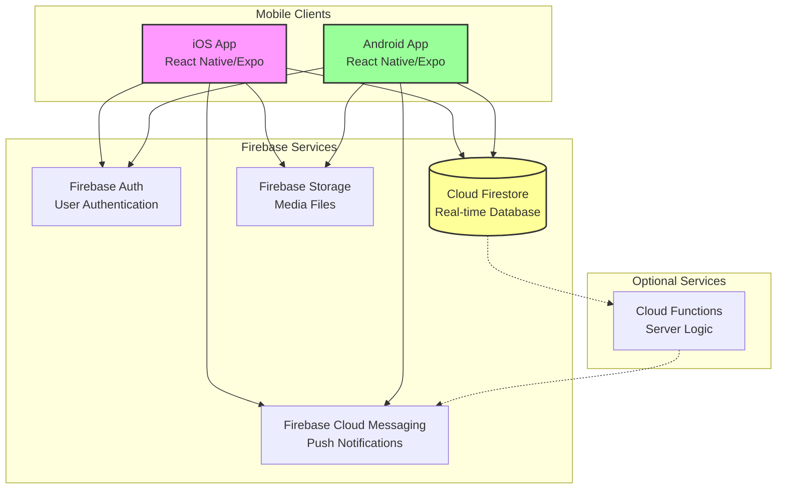

# High Level Architecture

## Technical Summary

yipyap is a **mobile-first, real-time messaging platform** built using React Native/Expo with a serverless Firebase backend architecture. The system employs a **client-heavy architecture pattern** where React Native handles the presentation layer and business logic, while Firebase provides managed backend services for authentication, real-time data synchronization, and push notifications. The architecture prioritizes **sub-500ms message delivery** through Firestore's real-time listeners, **offline-first design** with automatic sync, and **optimistic UI updates** for perceived instant performance. The infrastructure leverages Firebase's global edge network for scalability to support 1,000+ concurrent users while maintaining cost efficiency within Firebase's free tier or defined budget limits.

## Platform and Infrastructure Choice

**Platform:** Firebase (Google Cloud Platform)
**Key Services:**

- Firebase Authentication (user management)
- Cloud Firestore (real-time NoSQL database)
- Firebase Storage (profile photos, media)
- Firebase Cloud Messaging (push notifications)
- Firebase Hosting (if needed for web version later)

**Deployment Host and Regions:**

- Primary: us-central1 (Firebase default)
- Multi-region replication available for Firestore if needed

**Rationale:** Firebase was already specified in the PRD as the backend platform. It provides:

- Built-in real-time synchronization perfect for chat applications
- Offline persistence with automatic sync
- Managed infrastructure requiring zero DevOps
- Cost-effective for MVP with generous free tier
- Native SDKs optimized for React Native

## Repository Structure

**Structure:** Monorepo
**Monorepo Tool:** npm workspaces (built-in, no additional tooling needed for MVP)
**Package Organization:** Single package for now, can expand to packages structure if needed in Phase 2

The existing project structure is already set up as a monorepo with potential for expansion.

## High Level Architecture Diagram

## Architectural Patterns

- **Client-Heavy Architecture:** Business logic resides in React Native app, Firebase handles data persistence - _Rationale:_ Reduces backend complexity and leverages Firebase's managed services
- **Offline-First Pattern:** Local caching with background sync when connected - _Rationale:_ Essential for mobile messaging apps with intermittent connectivity
- **Optimistic UI Updates:** Show user actions immediately, reconcile with server later - _Rationale:_ Provides instant feedback for sub-500ms perceived performance
- **Component-Based UI:** Reusable React Native components with TypeScript - _Rationale:_ Maintainability and type safety across the codebase
- **Real-time Event-Driven:** Firestore listeners for live data updates - _Rationale:_ Core requirement for instant message delivery
- **Repository Pattern:** Abstract Firestore data access behind service layer - _Rationale:_ Testability and potential future database migration
- **Observer Pattern:** React hooks for state management and real-time updates - _Rationale:_ Natural fit with React's reactive paradigm

---
