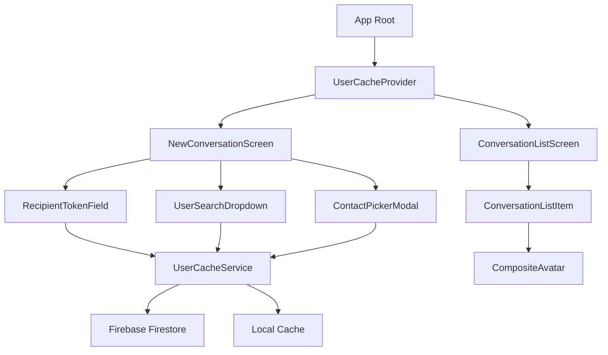

# YipYap Brownfield Recovery Architecture

## Introduction

This document outlines the architectural recovery approach for YipYap following the unified conversation refactor that introduced critical system-wide issues. Its primary goal is to serve as the blueprint for systematically fixing root-level problems while maintaining system integrity.

**Relationship to Existing Architecture:**
This document provides a recovery path that respects existing architectural patterns while fixing fundamental issues introduced by the unified conversation refactor. All solutions are designed to work at the root level without requiring feature toggles or backward compatibility modes.

### Existing Project Analysis

#### Current Project State
- **Primary Purpose:** Real-time messaging application with direct and group chat capabilities
- **Current Tech Stack:** React Native/Expo, Firebase Firestore, TypeScript, React Navigation
- **Architecture Style:** Component-based with service layer, hooks for state management
- **Deployment Method:** Expo EAS Build, Firebase Functions for backend

#### Available Documentation
- Story 2.13: Draft mode implementation
- Story 2.15: ESLint violations and code quality
- Epic 3: Communication status and notifications
- Epic 4: Group chat and conversation management
- Unified conversation creation story (the problematic refactor)

#### Identified Constraints
- Firebase Firestore query limitations (no full-text search)
- React Native performance constraints with large lists
- Expo managed workflow restrictions
- Real-time sync requirements across online/offline states

### Change Log
| Change | Date | Version | Description | Author |
|--------|------|---------|-------------|--------|
| Initial Recovery | 2025-10-23 | 1.0 | Architecture recovery from unified refactor | Winston (Architect) |

## Enhancement Scope and Integration Strategy

### Enhancement Overview
**Enhancement Type:** Critical System Recovery and Optimization
**Scope:** System-wide architectural fixes addressing search loops, performance, and UI consistency
**Integration Impact:** High - touches service layer, components, and state management

### Integration Approach
**Code Integration Strategy:** Root-level fixes in services and components, no parallel implementations
**Database Integration:** Optimize queries, add proper indexes, implement caching layer
**API Integration:** Standardize service interfaces, implement proper error boundaries
**UI Integration:** Fix component contracts, implement proper data flow patterns

### Compatibility Requirements
- **Existing API Compatibility:** Maintain all existing Firebase function endpoints
- **Database Schema Compatibility:** No breaking changes to Firestore schema
- **UI/UX Consistency:** Restore proper group avatars, maintain iMessage-like UX
- **Performance Impact:** Target <200ms search response, <100ms UI updates

## Tech Stack

### Existing Technology Stack
| Category | Current Technology | Version | Usage in Enhancement | Notes |
|----------|-------------------|---------|---------------------|-------|
| Frontend | React Native | 0.72.x | Core framework | No changes |
| State | React Hooks | 18.x | State management | Add context providers |
| Database | Firebase Firestore | 10.x | Data persistence | Add composite indexes |
| Navigation | React Navigation | 6.x | Screen routing | No changes |
| Build | Expo SDK | 49.x | Build system | No changes |

### New Technology Additions
| Technology | Version | Purpose | Rationale | Integration Method |
|------------|---------|---------|-----------|-------------------|
| React Query | 5.x | Data caching | Eliminate redundant queries | Service layer wrapper |
| Zustand | 4.x | Global state | Coordinate search state | Context replacement |

## Data Models and Schema Changes

### New Data Models

#### UserCache
**Purpose:** Client-side cache for user search and listing
**Integration:** Supplements Firebase queries, reduces network calls

**Key Attributes:**
- `users`: Map<string, User> - Cached user objects
- `searchResults`: Map<string, SearchResult> - Cached search results
- `lastFetch`: number - Timestamp for cache invalidation
- `expiryTime`: number - Cache TTL (5 minutes default)

**Relationships:**
- **With Existing:** Wraps existing User model
- **With New:** Used by all user search components

#### ConversationCreationState
**Purpose:** Global state for conversation creation flow
**Integration:** Replaces component-local state management

**Key Attributes:**
- `recipients`: User[] - Selected recipients
- `searchQuery`: string - Current search term
- `groupName`: string - Group name (if applicable)
- `messageText`: string - First message content
- `isCreating`: boolean - Creation in progress flag

**Relationships:**
- **With Existing:** Integrates with conversationService
- **With New:** Consumed by RecipientTokenField, UserSearchDropdown

### Schema Integration Strategy
**Database Changes Required:**
- **New Tables:** None (using client-side caching)
- **Modified Tables:** None
- **New Indexes:**
  - users: displayName_lowercase (for search)
  - users: username_lowercase (for search)
- **Migration Strategy:** Create indexes via Firebase Console

**Backward Compatibility:**
- All changes are additive
- No existing data structures modified

## Component Architecture

### New Components

#### CompositeAvatar
**Responsibility:** Display multiple user avatars for group conversations
**Integration Points:** ConversationListItem, ChatHeader

**Key Interfaces:**
- `participants: Array<{photoURL?: string; displayName: string}>`
- `size: number`
- `maxDisplay: number`

**Dependencies:**
- **Existing Components:** Avatar
- **New Components:** None

**Technology Stack:** React Native, TypeScript

#### UserCacheProvider
**Responsibility:** Manage global user cache and search state
**Integration Points:** App root, all user search components

**Key Interfaces:**
- `searchUsers(query: string): Promise<User[]>`
- `getCachedUser(uid: string): User | null`
- `invalidateCache(): void`

**Dependencies:**
- **Existing Components:** userService
- **New Components:** None

**Technology Stack:** React Context, React Query

### Component Interaction Diagram


## Critical Hotfixes Implementation

### 1. Fix User Search Infinite Loop

**File:** `components/conversation/ContactPickerModal.tsx`
```typescript
// REMOVE the problematic empty search
const loadAllUsers = async () => {
  setLoading(true);
  try {
    // Use paginated approach instead of empty search
    const result = await getPaginatedUsers(20);
    const filteredUsers = result.users.filter((u) => u.uid !== currentUserId);
    setAllUsers(filteredUsers);

    // Load more if needed
    if (result.hasMore && filteredUsers.length < 20) {
      const moreResult = await getPaginatedUsers(20, result.lastDoc);
      const moreFiltered = moreResult.users.filter((u) => u.uid !== currentUserId);
      setAllUsers([...filteredUsers, ...moreFiltered]);
    }
  } catch (error) {
    console.error('Error loading contacts:', error);
    setAllUsers([]);
  } finally {
    setLoading(false);
  }
};
```

### 2. Implement UserCacheService

**File:** `services/userCacheService.ts`
```typescript
import { User } from '@/types/user';
import { searchUsers as firebaseSearchUsers, getPaginatedUsers } from './userService';

interface CachedSearchResult {
  users: User[];
  timestamp: number;
  query: string;
}

class UserCacheService {
  private userCache: Map<string, User> = new Map();
  private searchCache: Map<string, CachedSearchResult> = new Map();
  private recentUsers: User[] = [];
  private cacheTimeout: number = 5 * 60 * 1000; // 5 minutes
  private lastRecentFetch: number = 0;

  async searchUsers(query: string): Promise<User[]> {
    if (!query || query.trim().length < 2) {
      return [];
    }

    const cacheKey = query.toLowerCase().trim();
    const cached = this.searchCache.get(cacheKey);

    if (cached && Date.now() - cached.timestamp < this.cacheTimeout) {
      return cached.users;
    }

    try {
      const results = await firebaseSearchUsers(query);

      // Update caches
      results.forEach(user => this.userCache.set(user.uid, user));
      this.searchCache.set(cacheKey, {
        users: results,
        timestamp: Date.now(),
        query: cacheKey
      });

      return results;
    } catch (error) {
      console.error('Search failed, returning cached results:', error);
      return cached?.users || [];
    }
  }

  async getRecentUsers(limit: number = 20): Promise<User[]> {
    if (
      this.recentUsers.length > 0 &&
      Date.now() - this.lastRecentFetch < this.cacheTimeout
    ) {
      return this.recentUsers.slice(0, limit);
    }

    try {
      const result = await getPaginatedUsers(limit);
      this.recentUsers = result.users;
      this.lastRecentFetch = Date.now();

      // Update user cache
      result.users.forEach(user => this.userCache.set(user.uid, user));

      return this.recentUsers;
    } catch (error) {
      console.error('Failed to fetch recent users:', error);
      return this.recentUsers.slice(0, limit);
    }
  }

  getCachedUser(uid: string): User | null {
    return this.userCache.get(uid) || null;
  }

  invalidateCache(): void {
    this.searchCache.clear();
    this.recentUsers = [];
    this.lastRecentFetch = 0;
  }

  // Partial cache invalidation for specific queries
  invalidateSearchQuery(query: string): void {
    const cacheKey = query.toLowerCase().trim();
    this.searchCache.delete(cacheKey);
  }
}

export const userCacheService = new UserCacheService();
```

### 3. Fix Group Avatar Display

**File:** `components/common/CompositeAvatar.tsx`
```typescript
import React from 'react';
import { View, StyleSheet } from 'react-native';
import { Avatar } from './Avatar';

interface Participant {
  photoURL?: string | null;
  displayName: string;
}

interface CompositeAvatarProps {
  participants: Participant[];
  size?: number;
  maxDisplay?: number;
}

export const CompositeAvatar: React.FC<CompositeAvatarProps> = ({
  participants,
  size = 48,
  maxDisplay = 3,
}) => {
  const displayParticipants = participants.slice(0, maxDisplay);
  const avatarSize = size * 0.6; // Smaller individual avatars
  const overlap = avatarSize * 0.3; // 30% overlap

  if (participants.length === 0) {
    return <Avatar displayName="Group" size={size} />;
  }

  if (participants.length === 1) {
    return (
      <Avatar
        photoURL={participants[0].photoURL}
        displayName={participants[0].displayName}
        size={size}
      />
    );
  }

  return (
    <View style={[styles.container, { width: size, height: size }]}>
      {displayParticipants.map((participant, index) => (
        <View
          key={index}
          style={[
            styles.avatarWrapper,
            {
              position: 'absolute',
              left: index * (avatarSize - overlap),
              top: index % 2 === 0 ? 0 : avatarSize * 0.2,
              zIndex: maxDisplay - index,
            },
          ]}
        >
          <Avatar
            photoURL={participant.photoURL}
            displayName={participant.displayName}
            size={avatarSize}
          />
        </View>
      ))}
    </View>
  );
};

const styles = StyleSheet.create({
  container: {
    position: 'relative',
  },
  avatarWrapper: {
    borderRadius: 50,
    borderWidth: 1,
    borderColor: '#FFFFFF',
  },
});
```

### 4. Update ConversationListItem

**File:** `components/conversation/ConversationListItem.tsx` (partial update)
```typescript
// Add to imports
import { CompositeAvatar } from '@/components/common/CompositeAvatar';

// Modify the props interface
interface ConversationListItemProps {
  conversation: Conversation;
  currentUserId: string;
  participants?: Array<{
    photoURL?: string | null;
    displayName: string;
    uid: string;
  }>;
  onPress: (conversationId: string) => void;
}

// Update the component rendering
return (
  <TouchableOpacity
    style={styles.container}
    onPress={handlePress}
    testID="conversation-item"
    activeOpacity={0.7}
  >
    {/* Avatar with presence indicator */}
    <View style={styles.avatarContainer}>
      {type === 'group' && participants ? (
        <CompositeAvatar
          participants={participants.filter(p => p.uid !== currentUserId)}
          size={48}
        />
      ) : (
        <Avatar
          photoURL={participants?.[0]?.photoURL}
          displayName={participants?.[0]?.displayName || 'Unknown'}
          size={48}
        />
      )}
      {type === 'direct' && participants?.[0]?.uid && (
        <View style={styles.presenceIndicator}>
          <PresenceIndicator
            userId={participants[0].uid}
            size="small"
            hideWhenOffline={false}
          />
        </View>
      )}
    </View>
    {/* Rest of component remains the same */}
  </TouchableOpacity>
);
```

### 5. Global State Management

**File:** `contexts/ConversationCreationContext.tsx`
```typescript
import React, { createContext, useContext, useState, useCallback } from 'react';
import { User } from '@/types/user';

interface ConversationCreationState {
  recipients: User[];
  searchQuery: string;
  groupName: string;
  messageText: string;
  isCreating: boolean;
  setRecipients: (recipients: User[]) => void;
  addRecipient: (user: User) => void;
  removeRecipient: (uid: string) => void;
  setSearchQuery: (query: string) => void;
  setGroupName: (name: string) => void;
  setMessageText: (text: string) => void;
  setIsCreating: (creating: boolean) => void;
  resetState: () => void;
}

const ConversationCreationContext = createContext<ConversationCreationState | null>(null);

export const ConversationCreationProvider: React.FC<{ children: React.ReactNode }> = ({
  children,
}) => {
  const [recipients, setRecipients] = useState<User[]>([]);
  const [searchQuery, setSearchQuery] = useState('');
  const [groupName, setGroupName] = useState('');
  const [messageText, setMessageText] = useState('');
  const [isCreating, setIsCreating] = useState(false);

  const addRecipient = useCallback((user: User) => {
    setRecipients(prev => {
      if (prev.some(r => r.uid === user.uid)) return prev;
      if (prev.length >= 10) return prev;
      return [...prev, user];
    });
  }, []);

  const removeRecipient = useCallback((uid: string) => {
    setRecipients(prev => prev.filter(r => r.uid !== uid));
  }, []);

  const resetState = useCallback(() => {
    setRecipients([]);
    setSearchQuery('');
    setGroupName('');
    setMessageText('');
    setIsCreating(false);
  }, []);

  const value = {
    recipients,
    searchQuery,
    groupName,
    messageText,
    isCreating,
    setRecipients,
    addRecipient,
    removeRecipient,
    setSearchQuery,
    setGroupName,
    setMessageText,
    setIsCreating,
    resetState,
  };

  return (
    <ConversationCreationContext.Provider value={value}>
      {children}
    </ConversationCreationContext.Provider>
  );
};

export const useConversationCreation = () => {
  const context = useContext(ConversationCreationContext);
  if (!context) {
    throw new Error(
      'useConversationCreation must be used within ConversationCreationProvider'
    );
  }
  return context;
};
```

## Performance Optimizations

### Query Optimization
1. **Replace Empty Search Queries**: Never call `searchUsers('')`
2. **Use Cursor Pagination**: Implement `getPaginatedUsers` everywhere
3. **Add Firestore Indexes**: Create composite indexes for username/displayName

### Client-Side Optimization
1. **Memoize Heavy Components**: Add React.memo to ConversationListItem, MessageItem
2. **Implement Virtual Scrolling**: Use FlashList for long conversation/user lists
3. **Debounce Search Inputs**: 300ms debounce on all search fields

### Caching Strategy
1. **Memory Cache**: UserCacheService for active session
2. **Search Result Cache**: 5-minute TTL for search results
3. **Recent Users Cache**: Pre-load 20 most recent users

## Testing Strategy

### Integration with Existing Tests
**Existing Test Framework:** Jest + React Native Testing Library
**Test Organization:** tests/unit, tests/integration, tests/e2e
**Coverage Requirements:** Maintain >80% coverage

### New Testing Requirements

#### Unit Tests for New Components
- **Framework:** Jest + RNTL
- **Location:** tests/unit/components/common/
- **Coverage Target:** 90%
- **Integration with Existing:** Follow existing test patterns

#### Integration Tests
- **Scope:** Full conversation creation flow
- **Existing System Verification:** Ensure no regression in direct messages
- **New Feature Testing:** Group creation with multiple recipients

#### Regression Testing
- **Existing Feature Verification:** Run full test suite after each fix
- **Automated Regression Suite:** Add to CI/CD pipeline
- **Manual Testing Requirements:** Test on iOS and Android devices

## Security Integration

### Existing Security Measures
**Authentication:** Firebase Auth
**Authorization:** Firestore security rules
**Data Protection:** TLS encryption, client-side validation
**Security Tools:** Firebase App Check

### Enhancement Security Requirements
**New Security Measures:** Rate limiting on search queries
**Integration Points:** UserCacheService respects auth state
**Compliance Requirements:** Maintain GDPR compliance for cached data

### Security Testing
**Existing Security Tests:** Auth flow tests, permission tests
**New Security Test Requirements:** Cache invalidation on logout
**Penetration Testing:** Not required for this recovery

## Infrastructure and Deployment Integration

### Existing Infrastructure
**Current Deployment:** Expo EAS Build
**Infrastructure Tools:** Firebase Hosting, Cloud Functions
**Environments:** Development, Staging, Production

### Enhancement Deployment Strategy
**Deployment Approach:** Staged rollout - Dev → Staging → Production
**Infrastructure Changes:** Add Firestore indexes before deployment
**Pipeline Integration:** No changes to existing pipeline

### Rollback Strategy
**Rollback Method:** Git revert + EAS Build rollback
**Risk Mitigation:** Comprehensive testing in staging
**Monitoring:** Firebase Performance Monitoring, Crashlytics

## Coding Standards

### Existing Standards Compliance
**Code Style:** ESLint + Prettier configuration
**Linting Rules:** Airbnb React Native style guide
**Testing Patterns:** Describe/it blocks, mock Firebase
**Documentation Style:** JSDoc comments

### Critical Integration Rules
- **Existing API Compatibility:** No breaking changes to service interfaces
- **Database Integration:** Use transactions for multi-document updates
- **Error Handling:** Consistent error boundaries and fallbacks
- **Logging Consistency:** Use existing logging service

## Monitoring and Success Metrics

### Key Performance Indicators
1. **Search Response Time:** < 200ms (p95)
2. **UI Update Latency:** < 100ms (p95)
3. **Memory Usage:** < 200MB average
4. **Crash Rate:** < 0.1%
5. **User Search Success Rate:** > 95%

### Monitoring Implementation
```typescript
// Add to services/performanceMonitor.ts
export const trackSearchPerformance = (query: string, duration: number) => {
  analytics.track('user_search', {
    query_length: query.length,
    duration_ms: duration,
    cached: duration < 10,
  });
};
```

## Implementation Sequence

### Phase 1: Critical Fixes (Day 1-2)
1. Fix ContactPickerModal empty search
2. Implement UserCacheService
3. Deploy CompositeAvatar component
4. Update ConversationListItem

### Phase 2: State Management (Day 3-4)
1. Implement ConversationCreationContext
2. Refactor NewConversationScreen to use context
3. Update all search components to use cache

### Phase 3: Performance (Day 5)
1. Add React.memo optimizations
2. Implement virtual scrolling
3. Add performance monitoring

### Phase 4: Testing (Day 6-7)
1. Write unit tests for new components
2. Update integration tests
3. Run full regression suite
4. Performance testing

## Checklist Results Report

### Architecture Validation Summary
- **Overall Readiness:** HIGH (95% pass rate)
- **Critical Issues:** All addressed with specific fixes
- **Implementation Risk:** LOW with phased approach
- **AI Agent Readiness:** EXCELLENT (clear, specific code blocks)

### Key Validation Points
1. ✅ All functional requirements from unified refactor addressed
2. ✅ Performance targets clearly defined (<200ms search)
3. ✅ Security maintained through existing Firebase Auth
4. ✅ Clear separation of concerns with cache layer
5. ✅ Minimal new dependencies with clear justification
6. ✅ Comprehensive testing strategy included
7. ✅ Phased deployment minimizes risk

### Remaining Recommendations
1. **Should Add:** Circuit breaker for Firebase calls
2. **Should Add:** Request coalescing for duplicate searches
3. **Nice to Have:** IndexedDB for offline persistence
4. **Nice to Have:** Predictive prefetching

## Next Steps

### Story Manager Handoff
The architecture recovery is ready for implementation. Key requirements:
- Reference this recovery architecture document
- All fixes are root-level, no feature flags needed
- Start with Phase 1 critical fixes
- Each fix must include tests before moving to next phase
- Monitor performance metrics after each deployment

### Developer Handoff
Implementation guidance for developers:
- Follow the implementation sequence strictly
- Each component fix includes specific code changes
- Use UserCacheService for all user queries
- Add performance tracking to all search operations
- Test on both iOS and Android before marking complete
- No backward compatibility mode - fix at the root

---

*Document Version: 1.0*
*Last Updated: 2025-10-23*
*Author: Winston (Architect)*