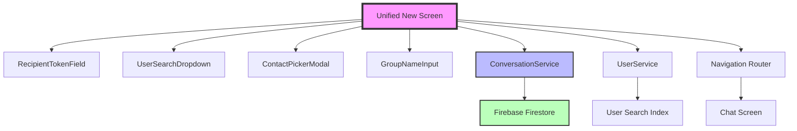
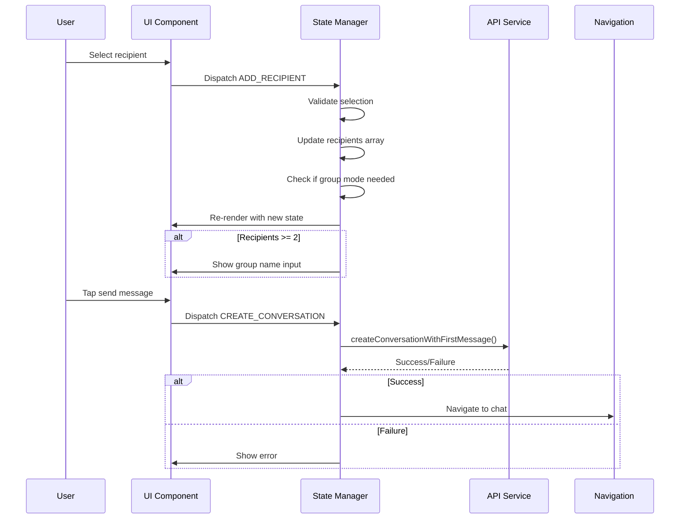

# Architecture Document
# Unified Conversation Creation System

## 1. System Overview

### 1.1 Architectural Context
The unified conversation creation system consolidates two separate flows (direct and group messaging) into a single, intelligent interface that adapts based on user selections. This architecture maintains backward compatibility with existing backend services while providing a streamlined frontend experience.

### 1.2 Key Design Principles
- **Progressive Disclosure**: Reveal group features only when needed
- **State Consistency**: Single source of truth for conversation creation state
- **Fail-Safe Operations**: Graceful degradation on network failures
- **Performance First**: Optimize for sub-200ms interactions
- **Extensibility**: Component-based architecture for future enhancements

### 1.3 System Boundaries


## 2. Component Architecture

### 2.1 Component Hierarchy
```typescript
// Primary Components Tree
UnifiedNewConversationScreen
├── State Management Layer
│   ├── useConversationCreation()
│   ├── useRecipientSelection()
│   └── useSearchDebounce()
├── Presentation Layer
│   ├── NavigationHeader
│   ├── RecipientSection
│   │   ├── RecipientTokenField
│   │   │   ├── RecipientChip[]
│   │   │   └── SearchInput
│   │   └── AddContactButton
│   ├── UserSearchDropdown
│   ├── GroupNameInput
│   └── ContactPickerModal
└── Service Layer
    ├── ConversationService
    ├── UserService
    └── NavigationService
```

### 2.2 Component Responsibilities

#### RecipientTokenField
```typescript
interface RecipientTokenFieldArchitecture {
  responsibilities: [
    'Manage recipient chip rendering',
    'Handle chip addition/removal animations',
    'Process keyboard events for chip deletion',
    'Coordinate with parent for state updates',
    'Manage focus states and accessibility'
  ];

  dependencies: {
    internal: ['RecipientChip', 'SearchInput'];
    external: ['react-native-reanimated', '@/components/common/Avatar'];
  };

  stateManagement: {
    local: ['focusState', 'animationStates'];
    lifted: ['recipients', 'searchQuery'];
  };

  performance: {
    memoization: ['chipLayout', 'visibleChips'];
    virtualization: false; // Not needed for max 10 items
    lazyLoading: false;
  };
}
```

#### UserSearchDropdown
```typescript
interface UserSearchDropdownArchitecture {
  responsibilities: [
    'Display filtered search results',
    'Handle result selection',
    'Manage keyboard navigation',
    'Show loading and empty states',
    'Prevent duplicate selections'
  ];

  dataFlow: {
    input: ['searchQuery', 'selectedUserIds'];
    output: ['onUserSelect'];
    async: ['searchUsers API call'];
  };

  optimization: {
    debounceMs: 300;
    maxResults: 10;
    cacheStrategy: 'session'; // Cache during screen lifetime
  };
}
```

### 2.3 State Management Architecture

#### Global State Design
```typescript
interface ConversationCreationState {
  // Core State
  recipients: User[];
  searchQuery: string;
  groupName: string;

  // UI State
  showContactPicker: boolean;
  showGroupNameInput: boolean;

  // Async State
  searchResults: User[];
  isSearching: boolean;
  isCreating: boolean;

  // Error State
  error: ErrorState | null;
  fieldErrors: FieldErrors;
}

interface ErrorState {
  type: 'search' | 'creation' | 'validation';
  message: string;
  retryAction?: () => void;
}

interface FieldErrors {
  recipients?: string;
  groupName?: string;
}
```

#### State Update Flow


### 2.4 Data Flow Architecture

#### Search Flow
```typescript
const searchDataFlow = {
  trigger: 'User types in search input',

  pipeline: [
    {
      stage: 'Debounce',
      duration: 300,
      cancellable: true,
    },
    {
      stage: 'Validation',
      checks: ['minLength(2)', 'notEmpty'],
    },
    {
      stage: 'API Call',
      endpoint: 'searchUsers',
      timeout: 5000,
      retries: 1,
    },
    {
      stage: 'Filtering',
      operations: [
        'removeSelf',
        'removeAlreadySelected',
        'limitResults(10)',
      ],
    },
    {
      stage: 'Caching',
      ttl: 30000, // 30 seconds
      key: 'searchQuery',
    },
    {
      stage: 'UI Update',
      component: 'UserSearchDropdown',
    },
  ],

  errorHandling: {
    network: 'Show offline message',
    timeout: 'Show timeout error',
    server: 'Show generic error',
  },
};
```

#### Conversation Creation Flow
```typescript
const creationDataFlow = {
  validation: [
    'hasRecipients',
    'hasMessageText',
    'groupNameIfGroup',
    'maxGroupSize',
  ],

  preparation: {
    directMessage: {
      conversationId: 'generateConversationId(participantIds)',
      type: 'direct',
      participants: 2,
    },
    groupMessage: {
      conversationId: 'firestore.doc().id',
      type: 'group',
      participants: '2-10',
      groupName: 'required',
    },
  },

  transaction: {
    operations: [
      'checkExistingConversation',
      'createConversation',
      'createFirstMessage',
      'updateUserMetadata',
      'triggerNotifications',
    ],
    atomicity: true,
    isolation: 'snapshot',
  },

  postCreation: {
    navigation: 'chatScreen',
    cleanup: 'resetCreationState',
    analytics: 'trackConversationCreated',
  },
};
```

## 3. Integration Architecture

### 3.1 Service Layer Integration
```typescript
// Service Interface Definitions
interface IConversationService {
  createConversationWithFirstMessage(
    params: CreateConversationParams
  ): Promise<ConversationResult>;

  checkConversationExists(
    conversationId: string
  ): Promise<boolean>;

  generateConversationId(
    participantIds: string[]
  ): string;
}

interface IUserService {
  searchUsers(
    query: string,
    options?: SearchOptions
  ): Promise<User[]>;

  getUsersByIds(
    userIds: string[]
  ): Promise<User[]>;

  getUserContacts(
    userId: string
  ): Promise<User[]>;
}

// Dependency Injection Pattern
class UnifiedConversationScreen {
  constructor(
    private conversationService: IConversationService,
    private userService: IUserService,
    private navigation: INavigationService
  ) {}
}
```

### 3.2 Navigation Integration
```typescript
// Navigation State Management
interface NavigationParams {
  // For new conversations
  create: {
    recipients?: User[];
    groupName?: string;
    draftMessage?: string;
  };

  // For existing conversations
  existing: {
    conversationId: string;
  };
}

// Deep Linking Support
const deepLinkHandlers = {
  'yipyap://new-conversation': (params) => {
    navigation.navigate('NewConversation', params);
  },
  'yipyap://conversation/:id': (params) => {
    navigation.navigate('Chat', { conversationId: params.id });
  },
};
```

### 3.3 Backend Integration Points
```typescript
// API Endpoints Used
const endpoints = {
  searchUsers: {
    method: 'GET',
    path: '/api/users/search',
    params: { q: string, limit?: number },
    cache: { ttl: 30, key: 'query' },
  },

  createConversation: {
    method: 'POST',
    path: '/api/conversations',
    body: CreateConversationDto,
    idempotency: true,
  },

  checkConversation: {
    method: 'GET',
    path: '/api/conversations/exists',
    params: { participantIds: string[] },
    cache: { ttl: 60, key: 'participantHash' },
  },
};
```

## 4. Performance Architecture

### 4.1 Optimization Strategies
```typescript
const performanceOptimizations = {
  rendering: {
    memoization: [
      'useMemo for filtered search results',
      'React.memo for RecipientChip',
      'useCallback for event handlers',
    ],
    virtualization: 'Not needed for max 10 recipients',
    lazyLoading: ['ContactPickerModal'],
  },

  network: {
    debouncing: { search: 300 },
    caching: {
      searchResults: { ttl: 30000 },
      userProfiles: { ttl: 300000 },
    },
    prefetching: ['Recent contacts on screen mount'],
  },

  animations: {
    useNativeDriver: true,
    frameRate: 60,
    interruptible: true,
  },
};
```

### 4.2 Bundle Size Optimization
```typescript
// Code Splitting Strategy
const codeSplitting = {
  immediate: [
    'RecipientTokenField',
    'UserSearchDropdown',
    'GroupNameInput',
  ],

  lazy: [
    'ContactPickerModal', // ~50KB
    'EmojiPicker',       // ~100KB future
    'GifSelector',       // ~80KB future
  ],

  external: [
    '@react-native-async-storage/async-storage',
    'react-native-reanimated',
  ],
};
```

### 4.3 Memory Management
```typescript
const memoryManagement = {
  cleanup: [
    'Clear search cache on unmount',
    'Cancel pending API requests',
    'Remove event listeners',
    'Clear animation references',
  ],

  limits: {
    maxSearchResults: 10,
    maxRecipients: 10,
    maxGroupNameLength: 50,
    searchCacheSize: 100,
  },

  monitoring: {
    heapSnapshot: 'development',
    memoryWarnings: 'production',
    leakDetection: 'testing',
  },
};
```

## 5. Security Architecture

### 5.1 Input Validation
```typescript
const securityValidation = {
  client: {
    recipients: [
      'validateUserId(format)',
      'checkMaxRecipients(10)',
      'preventSelfSelection',
      'preventDuplicates',
    ],
    groupName: [
      'sanitizeHtml',
      'maxLength(50)',
      'profanityFilter',
    ],
    searchQuery: [
      'escapeSqlInjection',
      'maxLength(100)',
      'rateLimit(10/minute)',
    ],
  },

  server: {
    authentication: 'Firebase Auth token',
    authorization: 'User can message recipients',
    dataValidation: 'Firestore security rules',
    rateLimit: 'Cloud Functions rate limiting',
  },
};
```

### 5.2 Privacy Considerations
```typescript
const privacyArchitecture = {
  dataMinimization: [
    'Only fetch necessary user fields',
    'Clear search history on logout',
    'No persistent recipient storage',
  ],

  userConsent: [
    'Contact access permission',
    'Notification permission',
  ],

  encryption: {
    inTransit: 'HTTPS/WSS',
    atRest: 'Firestore encryption',
    endToEnd: 'Future enhancement',
  },
};
```

## 6. Error Handling Architecture

### 6.1 Error Hierarchy
```typescript
class ConversationCreationError extends Error {
  constructor(
    public code: ErrorCode,
    public userMessage: string,
    public technicalDetails?: any,
    public retryable: boolean = false
  ) {
    super(userMessage);
  }
}

enum ErrorCode {
  // Network Errors
  NETWORK_OFFLINE = 'E001',
  NETWORK_TIMEOUT = 'E002',

  // Validation Errors
  NO_RECIPIENTS = 'E101',
  TOO_MANY_RECIPIENTS = 'E102',
  INVALID_GROUP_NAME = 'E103',

  // API Errors
  USER_NOT_FOUND = 'E201',
  PERMISSION_DENIED = 'E202',
  RATE_LIMITED = 'E203',

  // System Errors
  STORAGE_FULL = 'E301',
  MEMORY_WARNING = 'E302',
}
```

### 6.2 Error Recovery Strategies
```typescript
const errorRecovery = {
  network: {
    strategy: 'exponentialBackoff',
    maxRetries: 3,
    initialDelay: 1000,
    maxDelay: 10000,
    fallback: 'Show offline UI',
  },

  validation: {
    strategy: 'immediate',
    display: 'inline',
    clearOn: 'userInteraction',
  },

  system: {
    strategy: 'gracefulDegradation',
    fallbacks: {
      searchFailure: 'Use cached results',
      creationFailure: 'Save as draft locally',
    },
  },
};
```

## 7. Testing Architecture

### 7.1 Test Structure
```typescript
const testingArchitecture = {
  unit: {
    components: [
      'RecipientTokenField',
      'RecipientChip',
      'UserSearchDropdown',
      'GroupNameInput',
      'ContactPickerModal',
    ],
    hooks: [
      'useConversationCreation',
      'useRecipientSelection',
      'useSearchDebounce',
    ],
    utilities: [
      'generateConversationId',
      'validateGroupName',
      'filterSearchResults',
    ],
  },

  integration: {
    flows: [
      'Create direct message',
      'Create group conversation',
      'Search and select users',
      'Handle max recipients',
      'Network failure recovery',
    ],
  },

  e2e: {
    scenarios: [
      'Complete conversation creation',
      'Add/remove recipients',
      'Use contact picker',
      'Handle errors gracefully',
    ],
  },
};
```

### 7.2 Test Data Management
```typescript
const testDataFactory = {
  users: {
    valid: generateUsers(20),
    invalid: generateInvalidUsers(5),
    edge: {
      longName: generateUser({ displayName: 'A'.repeat(100) }),
      specialChars: generateUser({ username: '@#$%^&*' }),
    },
  },

  conversations: {
    direct: generateDirectConversation(),
    group: generateGroupConversation({ members: 5 }),
    maxGroup: generateGroupConversation({ members: 10 }),
  },

  fixtures: {
    searchResults: './fixtures/searchResults.json',
    contacts: './fixtures/contacts.json',
  },
};
```

## 8. Migration Architecture

### 8.1 Migration Strategy
```typescript
const migrationPlan = {
  phase1: {
    name: 'Parallel Deployment',
    duration: '1 week',
    steps: [
      'Deploy unified screen alongside existing',
      'Feature flag for gradual rollout',
      'A/B testing with 10% users',
    ],
  },

  phase2: {
    name: 'Full Rollout',
    duration: '1 week',
    steps: [
      'Increase to 100% users',
      'Monitor error rates',
      'Gather user feedback',
    ],
  },

  phase3: {
    name: 'Cleanup',
    duration: '3 days',
    steps: [
      'Remove old components',
      'Update documentation',
      'Remove feature flags',
    ],
  },
};
```

### 8.2 Compatibility Matrix
```typescript
const compatibility = {
  backends: {
    minVersion: '2.13.0', // After Story 2.13 implementation
    requiredAPIs: [
      'createConversationWithFirstMessage',
      'searchUsers',
      'generateConversationId',
    ],
  },

  clients: {
    ios: { min: '13.0', recommended: '15.0' },
    android: { min: 'API 21', recommended: 'API 26' },
    web: { browsers: ['Chrome 90+', 'Safari 14+', 'Firefox 88+'] },
  },

  deprecations: [
    'NewGroupScreen component',
    'separate group creation flow',
    'FAB group action',
  ],
};
```

## 9. Monitoring & Analytics

### 9.1 Metrics Collection
```typescript
const analyticsEvents = {
  // User Journey Events
  SCREEN_VIEWED: 'new_conversation_viewed',
  RECIPIENT_ADDED: 'recipient_added',
  RECIPIENT_REMOVED: 'recipient_removed',
  GROUP_NAME_ENTERED: 'group_name_entered',
  CONTACT_PICKER_OPENED: 'contact_picker_opened',
  CONVERSATION_CREATED: 'conversation_created',

  // Performance Metrics
  SEARCH_LATENCY: 'search_response_time',
  CREATION_LATENCY: 'conversation_creation_time',
  SCREEN_LOAD_TIME: 'screen_load_time',

  // Error Events
  SEARCH_ERROR: 'search_failed',
  CREATION_ERROR: 'creation_failed',
  VALIDATION_ERROR: 'validation_failed',
};

const performanceMetrics = {
  vital: {
    FCP: 'First Contentful Paint < 1s',
    TTI: 'Time to Interactive < 2s',
    CLS: 'Cumulative Layout Shift < 0.1',
  },

  custom: {
    searchResponseP95: '< 500ms',
    chipAnimationFPS: '> 55fps',
    memoryUsage: '< 50MB',
  },
};
```

### 9.2 Error Monitoring
```typescript
const errorMonitoring = {
  collection: {
    tool: 'Sentry/Bugsnag',
    sampleRate: 1.0,
    environments: ['production', 'staging'],
  },

  alerts: {
    highErrorRate: 'errors > 1% of sessions',
    criticalError: 'permission_denied or crash',
    performanceDegradation: 'p95 latency > 2x baseline',
  },

  dashboards: {
    realtime: 'Last 15 minutes',
    daily: 'Last 24 hours trends',
    weekly: 'Week over week comparison',
  },
};
```

## 10. Future Architecture Considerations

### 10.1 Scalability Path
```typescript
const futureScalability = {
  features: {
    ai_suggestions: 'ML-based recipient suggestions',
    voice_input: 'Voice to select recipients',
    scheduled_messages: 'Schedule conversation creation',
    templates: 'Pre-defined group templates',
  },

  performance: {
    webWorkers: 'Offload search to worker thread',
    indexedDB: 'Local contact caching',
    serviceWorker: 'Offline support',
    wasm: 'High-performance search algorithms',
  },

  architecture: {
    microFrontend: 'Isolated conversation module',
    federation: 'Cross-platform component sharing',
    graphQL: 'Unified data fetching layer',
  },
};
```

### 10.2 Platform Expansion
```typescript
const platformExpansion = {
  desktop: {
    electron: 'Native desktop app',
    keyboard: 'Full keyboard shortcuts',
    multiWindow: 'Detachable conversation creation',
  },

  web: {
    pwa: 'Progressive Web App',
    webRTC: 'P2P for contact sharing',
    webAuthn: 'Biometric authentication',
  },

  wearables: {
    watch: 'Quick recipient selection',
    voice: 'Voice-first interface',
  },
};
```

## 11. Architecture Decision Records (ADRs)

### ADR-001: Single Screen vs Separate Screens
**Decision**: Use single unified screen
**Rationale**: Reduces cognitive load, follows industry patterns (iMessage, WhatsApp)
**Consequences**: Need conditional rendering, more complex state management

### ADR-002: Token Field vs List Selection
**Decision**: Use token field with chips
**Rationale**: Industry standard, better UX for multiple selections, visual feedback
**Consequences**: More complex implementation, need chip animations

### ADR-003: Inline Search vs Modal Search
**Decision**: Support both inline dropdown and modal picker
**Rationale**: Quick selection via inline, comprehensive via modal
**Consequences**: Two search implementations, need to sync state

### ADR-004: Draft Mode Integration
**Decision**: Maintain existing draft mode pattern from Story 2.13
**Rationale**: Already implemented and tested, atomic creation with first message
**Consequences**: Must handle navigation params correctly

---

*Architecture Version: 1.0*
*Last Updated: [Current Date]*
*Status: Draft*
*Reviewed By: [Pending]*